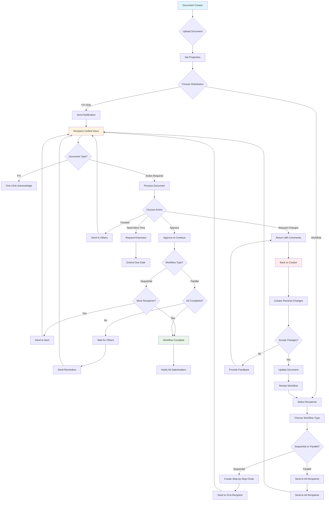
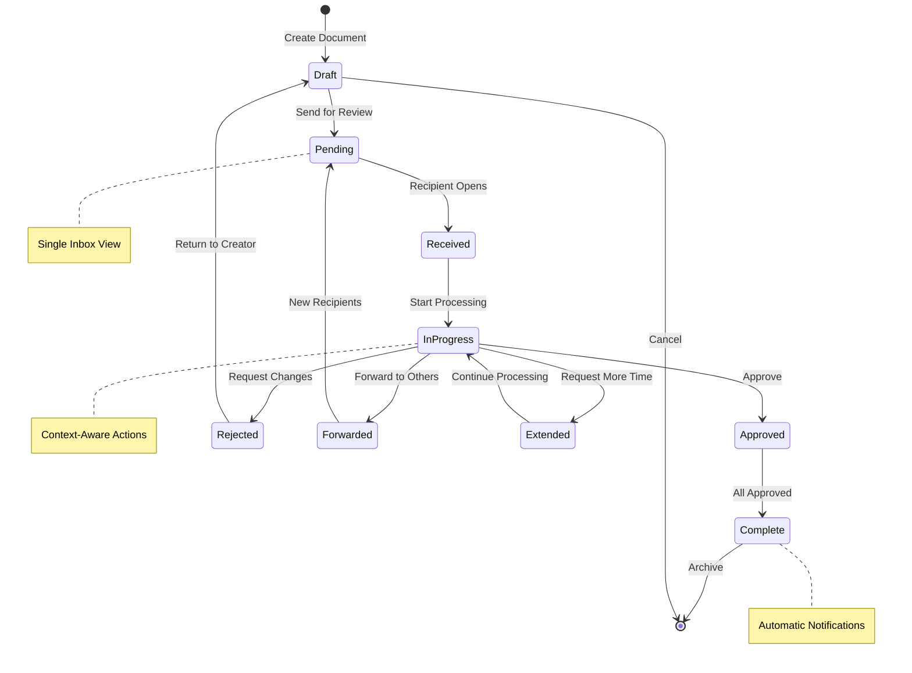
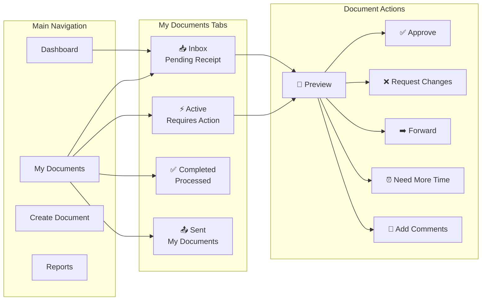

```mermaid
graph TD
    A[Document Creator] --> B{Upload Document}
    B --> C[Set Properties]
    C --> D{Choose Distribution}
    
    D -->|FYI Only| E[Send Notification]
    D -->|Workflow| F[Select Recipients]
    
    F --> G[Choose Workflow Type]
    G --> H{Sequential or Parallel?}
    
    H -->|Sequential| I[Create Step-by-Step Chain]
    H -->|Parallel| J[Send to All Recipients]
    
    I --> K[Send to First Recipient]
    J --> L[Send to All Recipients]
    
    K --> M[Recipient Unified Inbox]
    L --> M
    E --> M
    
    M --> N{Document Type?}
    N -->|FYI| O[One-Click Acknowledge]
    N -->|Action Required| P[Process Document]
    
    P --> Q{Choose Action}
    Q -->|Approve| R[Approve & Continue]
    Q -->|Request Changes| S[Return with Comments]
    Q -->|Forward| T[Send to Others]
    Q -->|Need More Time| U[Request Extension]
    
    R --> V{Workflow Type?}
    S --> W[Back to Creator]
    T --> M
    U --> X[Extend Due Date]
    
    V -->|Sequential| Y{More Recipients?}
    V -->|Parallel| Z{All Completed?}
    
    Y -->|Yes| AA[Send to Next]
    Y -->|No| BB[Workflow Complete]
    
    Z -->|No| CC[Wait for Others]
    Z -->|Yes| BB
    
    AA --> M
    CC --> DD[Send Reminders]
    DD --> M
    
    BB --> EE[Notify All Stakeholders]
    W --> FF[Creator Reviews Changes]
    FF --> GG{Accept Changes?}
    GG -->|Yes| HH[Update Document]
    GG -->|No| II[Provide Feedback]
    
    HH --> JJ[Restart Workflow]
    II --> S
    JJ --> F

    style A fill:#e1f5fe
    style M fill:#fff3e0
    style BB fill:#e8f5e8
    style W fill:#ffebee
```

## Workflow States and Transitions

```mermaid
stateDiagram-v2
    [*] --> Draft: Create Document
    Draft --> Pending: Send for Review
    Pending --> Received: Recipient Opens
    Received --> InProgress: Start Processing
    
    InProgress --> Approved: Approve
    InProgress --> Rejected: Request Changes
    InProgress --> Forwarded: Forward to Others
    InProgress --> Extended: Request More Time
    
    Approved --> Complete: All Approved
    Rejected --> Draft: Return to Creator
    Forwarded --> Pending: New Recipients
    Extended --> InProgress: Continue Processing
    
    Complete --> [*]: Archive
    Draft --> [*]: Cancel
    
    note right of Pending: Single Inbox View
    note right of InProgress: Context-Aware Actions
    note right of Complete: Automatic Notifications
```

## User Interface Layout

```mermaid
graph LR
    subgraph "Main Navigation"
        A[Dashboard]
        B[My Documents]
        C[Create Document]
        D[Reports]
    end
    
    subgraph "My Documents Tabs"
        E[📥 Inbox<br/>Pending Receipt]
        F[⚡ Active<br/>Requires Action]
        G[✅ Completed<br/>Processed]
        H[📤 Sent<br/>My Documents]
    end
    
    subgraph "Document Actions"
        I[👀 Preview]
        J[✅ Approve]
        K[❌ Request Changes]
        L[➡️ Forward]
        M[⏰ Need More Time]
        N[💬 Add Comments]
    end
    
    A --> E
    B --> E
    B --> F
    B --> G
    B --> H
    
    E --> I
    F --> I
    I --> J
    I --> K
    I --> L
    I --> M
    I --> N
```
